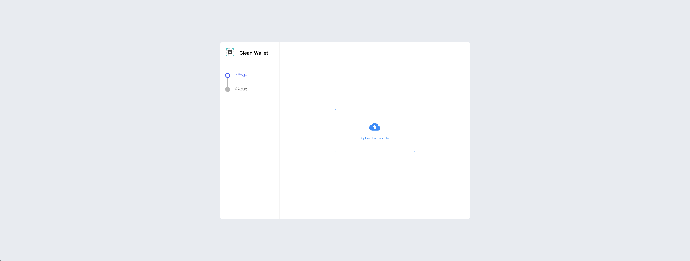

# Clean Wallet Blocklet

This is a blocklet for cleaning up wallet backups, cleaning up apps and accounts that have failed.

## Launch on Blocklet Server

[](https://install.arcblock.io/?action=blocklet-install&meta_url=https%3A%2F%2Fgithub.com%2Fblocklet%2Fclean-wallet%2Freleases%2Fdownload%2Fv1.0.2%2Fblocklet.json)

## Use Command line

### Start

With NPM:

```bash
npx clean-wallet
```

## Use blocklet

### Use

- Install local from [Store](https://store.blocklet.dev/) or [The official environment](https://clean-wallet-ygq-18-180-145-193.ip.abtnet.io/)

### Visuals




### Requirement

- A locally running

#### Clone and install dependencies

```shell
git clone git@github.com:blocklet/clean-wallet.git
cd clean-wallet && yarn install
```

#### Start debug

```shell
blocklet dev
```

#### Deploy to local Blocklet Server

```shell
npm run bundle
blocklet deploy .blocklet/bundle
```

## License

[MIT](LICENSE)
