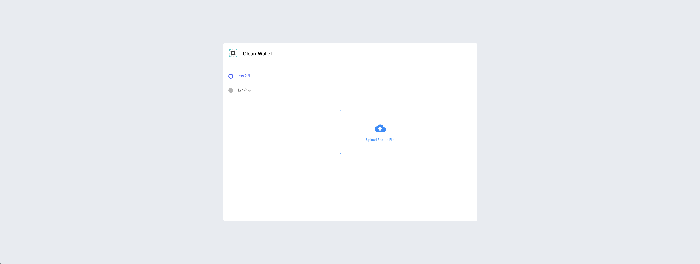
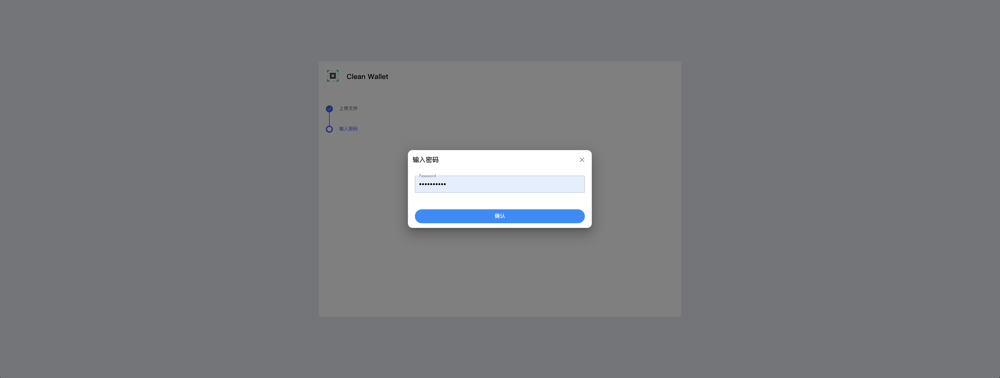
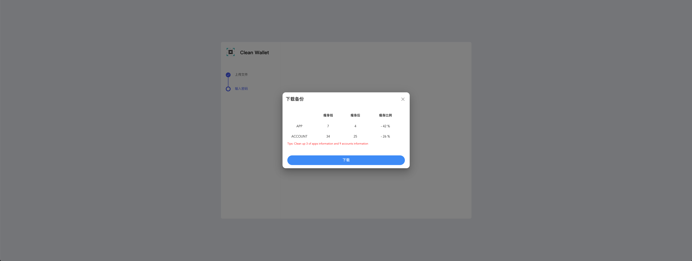

# clean-wallet

Helps users clean their DID WALLET backup file of unwanted data

## Use

- Install local from [Store](https://store.blocklet.dev/) or [The official environment](https://clean-wallet-ygq-18-180-145-193.ip.abtnet.io/)

## Visuals

